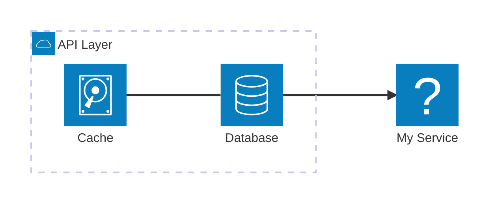
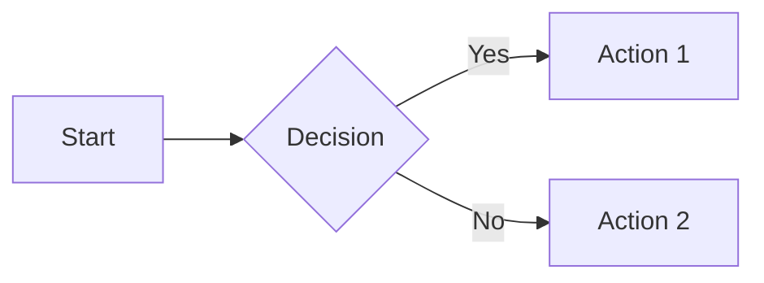

# Phase 6 Test with Advanced Diagrams

This document tests the diagram conversion workflow.

## Architecture Diagram

```mermaid
architecture-beta
    group api(cloud)[API Layer]
    
    service db(database)[Database] in api
    service cache(disk)[Cache] in api
    service myservice(logos:100tb)[My Service]
    db:L -- R:cache
    db:R --> L:myservice
```

## Custom Icon Diagram

```mermaid
flowchart LR
    A[Start] --> B{Decision}
    B -->|Yes| C[Action 1]
    B -->|No| D[Action 2]
```
