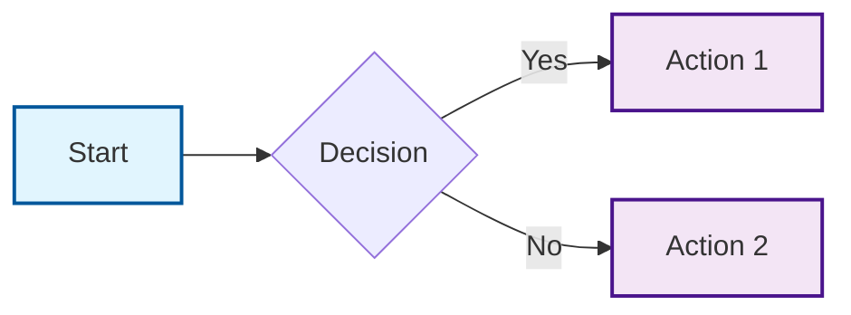

# Phase 6 Test with Advanced Diagrams

This document tests the diagram conversion workflow.

## Architecture Diagram


<details>
<summary>📊 View diagram source (click to expand)</summary>

```mermai

<details>
<summary>📊 View diagram source (click to expand)</summary>


</details>e1f5fe,stroke:#01579b,stroke-width:2px,icon:aws:compute
    classDef actionClass fill:#f3e5f5,stroke:#4a148c,stroke-width:2px,icon:azure:storage
    
    class A startClass
    class C,D actionClass
```