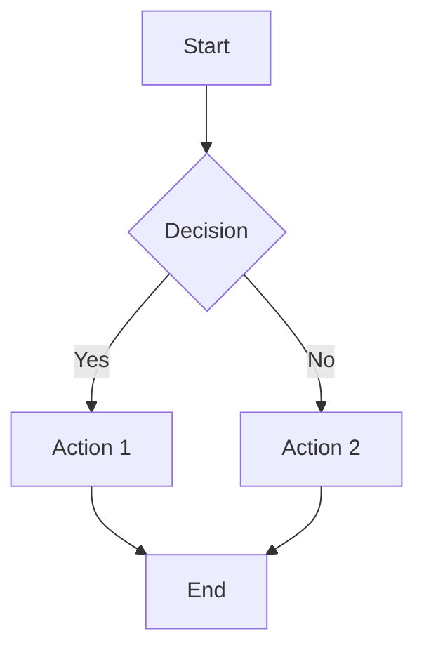

# Draw.io Export Implementation Plan

## Overview
Add Draw.io export functionality to the markdown-manager application, allowing users to convert Mermaid diagrams to Draw.io's editable PNG format (with embedded XML metadata) or raw XML format. This feature integrates seamlessly with the existing diagram export system.

## Feature Requirements

### User Experience
- **UI Integration**: Add new Draw.io dropdown button alongside existing SVG/PNG export buttons
- **Format Options**: Support both editable PNG (default) and raw XML export formats
- **Quality Feedback**: Provide conversion quality scoring via toast notifications after export
- **Non-blocking**: Never prevent downloads - always allow user to proceed regardless of quality score
- **Minimal Processing**: Frontend handles UI interaction only; backend/export-service handles conversion logic

### Technical Architecture
- **Request Flow**: Frontend → Backend API → Export Service → Response
- **Icon Strategy**: Always embed SVG icons directly (KISS principle)
- **Error Handling**: Use existing toast notification system for feedback
- **Testing**: Markdown file-based test cases for different diagram types

## Implementation Details

### 1. Frontend Changes

#### 1.1 Update DiagramControls Component
**File**: `frontend/src/components/renderer/DiagramControls.jsx`

**Current Structure**:
```jsx
<ButtonGroup>
  <Button>Fullscreen</Button>
  <Dropdown>Export (SVG/PNG)</Dropdown>
  <Button>GitHub Indicator</Button>
</ButtonGroup>
```

**Target Structure**:
```jsx
<ButtonGroup>
  <Button>Fullscreen</Button>
  <Button>Export SVG</Button>          // Existing - keep unchanged
  <Button>Export PNG</Button>          // Existing - keep unchanged
  <Dropdown>Draw.io ▼</Dropdown>       // NEW - Add this dropdown
  <Button>GitHub Indicator</Button>    // Existing - keep unchanged
</ButtonGroup>
```

**Implementation Requirements**:
- Add new `<Dropdown>` component after existing PNG button
- Dropdown options:
  - "Export as Draw.io (PNG)" - default selection
  - "Export as Draw.io (XML)" - alternative format
- Add click handlers that call `handleDrawioExport(format)`
- Maintain existing export state management pattern (`isExporting`, `exportFormat`)
- Use existing `markInteractionActive()` pattern for hover state management

#### 1.2 Update DiagramFullscreenModal Component
**File**: `frontend/src/components/renderer/DiagramFullscreenModal.jsx`

**Current Modal Footer**:
```jsx
<ButtonGroup>
  <Button>Export SVG</Button>
  <Button>Export PNG</Button>
  <Button>Close</Button>
</ButtonGroup>
```

**Target Modal Footer**:
```jsx
<ButtonGroup>
  <Button>Export SVG</Button>          // Existing - keep unchanged
  <Button>Export PNG</Button>          // Existing - keep unchanged
  <Dropdown>Draw.io ▼</Dropdown>       // NEW - Add this dropdown
  <Button>Close</Button>               // Existing - keep unchanged
</ButtonGroup>
```

**Implementation Requirements**:
- Mirror the same dropdown structure as DiagramControls
- Use same event handlers and state management
- Maintain fullscreen-specific export options (ultra-high resolution)

#### 1.3 Add Draw.io Export to ExportServiceApi
**File**: `frontend/src/api/exportServiceApi.js`

**Add New Method**:
```javascript
/**
 * Export diagram as Draw.io format using the export service
 * @param {string} htmlContent - HTML content containing the rendered diagram
 * @param {string} format - Export format ('png' for editable PNG, 'xml' for raw XML)
 * @param {Object} options - Export options
 * @returns {Promise<Object>} - Response with file data and quality score
 */
async exportDiagramAsDrawio(htmlContent, format, options = {}) {
  // Implementation details in plan
}
```

**Integration Points**:
- Follow existing pattern from `exportDiagramAsPNG()` and `exportDiagramAsSVG()`
- Use `extractSVGFromHTML()` helper to get SVG content
- Call backend route: `POST /api/export/drawio`
- Return both file data and conversion quality metadata

#### 1.4 Update MermaidExportService
**File**: `frontend/src/services/MermaidExportService.js`

**Add New Method**:
```javascript
async exportToDrawio(diagramElement, format, filename, options) {
  // Get SVG content from diagram element
  // Call exportServiceApi.exportDiagramAsDrawio()
  // Handle quality score in response
  // Trigger download with appropriate toast notification
}
```

**Quality Score Toast Messages**:
- **90-100%**: Success toast with green checkmark - "✅ Draw.io export completed (Excellent quality - XX%)"
- **75-89%**: Warning toast with yellow icon - "⚠️ Draw.io export completed (Good quality - XX%) - Minor adjustments may be needed"
- **60-74%**: Warning toast with orange icon - "⚠️ Draw.io export completed (Fair quality - XX%) - Review recommended"
- **<60%**: Error toast with red icon - "❌ Draw.io export completed (Poor quality - XX%) - Consider SVG export for better results"

### 2. Backend API Changes

#### 2.1 Add Draw.io Export Route
**File**: `backend/app/api/routes/export.py` (or similar export route file)

**Add New Endpoint**:
```python
@router.post("/drawio")
async def export_drawio(request: DrawioExportRequest):
    """
    Export diagram to Draw.io format via export service
    Minimal processing - just forward to export service
    """
    # Forward request to export service
    # Return response with file data and quality metadata
```

**Request/Response Models**:
```python
class DrawioExportRequest(BaseModel):
    html_content: str
    format: Literal["png", "xml"] = "png"
    width: Optional[int] = None
    height: Optional[int] = None
    is_dark_mode: bool = False

class DrawioExportResponse(BaseModel):
    file_data: str  # base64 encoded
    filename: str
    content_type: str
    quality_score: float
    quality_message: str
```

#### 2.2 Update Export Service Client
**File**: Check existing backend export service integration

**Requirements**:
- Add method to call export service `/api/export/diagram/drawio` endpoint
- Handle file data encoding/decoding
- Pass through quality metadata from export service

### 3. Export Service Changes

#### 3.1 Add Draw.io Router
**File**: `export-service/app/routers/drawio.py` (new file)

**Create New Router**:
```python
from fastapi import APIRouter, HTTPException
from ..services.drawio_service import DrawioService

router = APIRouter(prefix="/drawio", tags=["drawio"])

@router.post("/")
async def export_drawio(request: DrawioExportRequest):
    """Convert SVG diagram to Draw.io format"""
    # Use DrawioService to perform conversion
    # Return file data with quality score
```

#### 3.2 Implement Draw.io Conversion Service
**File**: `export-service/app/services/drawio_service.py` (new file)

**Core Functionality**:
```python
class DrawioService:
    def convert_svg_to_drawio_xml(self, svg_content: str) -> tuple[str, float]:
        """
        Convert SVG to Draw.io XML format
        Returns: (xml_content, quality_score)
        """

    def embed_xml_in_png(self, xml_content: str, png_data: bytes) -> bytes:
        """
        Embed Draw.io XML in PNG metadata for editable PNG format
        """

    def calculate_quality_score(self, svg_content: str, xml_content: str) -> tuple[float, str]:
        """
        Calculate conversion quality score based on:
        - Node preservation (40%)
        - Visual fidelity (30%)
        - Icon success rate (30%)
        """
```

**Quality Scoring Algorithm**:
- **Structural Fidelity (40%)**:
  - All mermaid nodes converted to Draw.io shapes
  - Connections maintained with proper start/end points
  - Layout preservation within ±10px tolerance
  - Text integrity (labels, titles, annotations)

- **Visual Quality (30%)**:
  - Colors, fonts, line styles maintained
  - Aspect ratio preservation
  - No shape distortion

- **Icon Success Rate (30%)**:
  - Percentage of SVG icons successfully embedded
  - Custom icon preservation
  - Standard icon mapping success

**Conversion Logic**:
- Parse SVG DOM structure
- Map SVG elements to Draw.io XML schema (`<mxGraphModel>` root)
- Extract and embed SVG icons as base64 data
- Generate proper Draw.io geometry and styling
- Calculate relative positioning for nodes and edges

#### 3.3 Update Main App
**File**: `export-service/app/main.py`

**Add Router Registration**:
```python
from .routers import drawio

app.include_router(drawio.router, prefix="/api/export")
```

### 4. Testing Strategy

#### 4.1 Create Test Cases Directory
**Location**: `tests/mermaid-drawio-samples/`

**Test Files Structure**:
```
tests/mermaid-drawio-samples/
├── flowchart-basic.md
├── flowchart-complex.md
├── architecture-aws.md
├── architecture-azure.md
├── sequence-diagram.md
└── README.md
```

**Sample Test File Format** (`flowchart-basic.md`):
```markdown
# Basic Flowchart Test



**Expected Outcomes:**
- High conversion quality (>90%)
- All nodes and connections preserved
- Labels maintained
- Standard flowchart layout
```

#### 4.2 Integration Tests
**File**: `backend/tests/test_drawio_export.py` (new file)

**Test Cases**:
- Basic SVG to Draw.io XML conversion
- PNG embedding functionality
- Quality score calculation
- Error handling for malformed SVG
- API endpoint integration

#### 4.3 Frontend Tests
**File**: `frontend/tests/components/DiagramControls.test.js`

**Additional Test Cases**:
- Draw.io dropdown rendering
- Export button click handling
- Toast notification display
- Quality score message formatting

### 5. Dependencies

#### 5.1 Export Service Dependencies
**File**: `export-service/pyproject.toml`

**Add Dependencies**:
```toml
[tool.poetry.dependencies]
# For PNG metadata manipulation
Pillow = "^10.0.0"
# For XML processing
lxml = "^4.9.0"
# For SVG parsing
beautifulsoup4 = "^4.12.0"
```

#### 5.2 Frontend Dependencies
No new dependencies required - uses existing React Bootstrap components.

### 6. Configuration

#### 6.1 Nginx Routing
Ensure existing nginx configuration routes `/api/export/drawio` to export service.

#### 6.2 Environment Variables
No new environment variables required for initial implementation.

### 7. Migration/Deployment Notes

#### 7.1 Rollout Strategy
- Feature can be deployed incrementally
- No database changes required
- Backward compatible with existing export functionality

#### 7.2 Monitoring
- Add logging for Draw.io conversion requests
- Track quality score distributions
- Monitor conversion failure rates

### 8. Future Enhancements

#### 8.1 Icon Library Mapping
- Map common icons (AWS, Azure) to Draw.io built-in libraries
- Reduce file sizes for standard icons
- Maintain SVG embedding for custom icons

#### 8.2 Batch Export
- Multiple diagram export to Draw.io format
- Document-level conversion with embedded diagrams

#### 8.3 Advanced Quality Metrics
- Layout similarity analysis
- Color accuracy measurement
- Font matching evaluation

## File Search Hints for Implementation

### Finding Existing Components
- **Diagram Controls**: Search for `DiagramControls` or `diagram-controls` class
- **Export Service**: Look in `frontend/src/api/` for `exportServiceApi.js`
- **Mermaid Service**: Search for `MermaidExportService` or `mermaid` in services
- **Toast Notifications**: Search for `notification` events or toast components
- **Export Routes**: Look in `backend/app/api/routes/` for export endpoints

### Architecture Patterns
- **Service Injection**: Look for `serviceFactory` usage patterns
- **API Routing**: Check existing export endpoints for routing patterns
- **Export Service**: Examine `export-service/app/routers/` for endpoint patterns
- **Component Structure**: Follow Bootstrap React patterns in existing modals/dropdowns

### Styling References
- **Button Groups**: Search for `ButtonGroup` components
- **Dropdowns**: Look for existing `Dropdown` implementations
- **Modal Structure**: Check `DiagramFullscreenModal` for layout patterns
- **Theme Integration**: Search for `useTheme` hook usage

This implementation plan provides complete specification for adding Draw.io export functionality while maintaining consistency with existing architecture and user experience patterns.