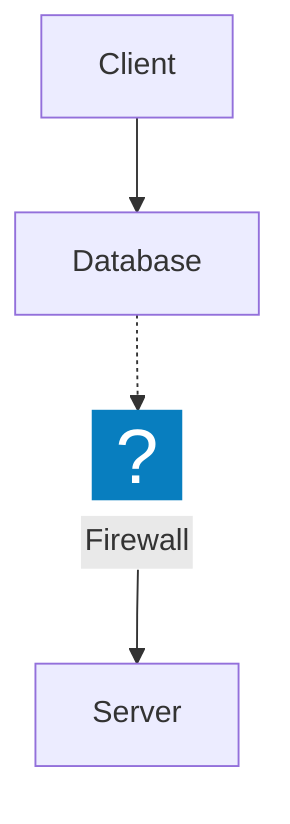

# Enhanced Mermaid → draw.io Converter with Icon Support

This converter transforms Mermaid diagrams into editable draw.io format, with full support for icon nodes fetched from an IconService API.

## Features

- **Icon Node Support**: Automatically fetches and embeds SVG icons from IconService API
- **Proper Text Positioning**: Icon nodes display labels at bottom center for clean presentation
- **SVG Compatibility**: Uses percent-encoded SVG data URIs to avoid parsing conflicts
- **Layout Preservation**: Maintains original Mermaid positioning and node relationships
- **Edge Support**: Handles solid arrows, dashed lines, and dotted connections
- **Fallback Handling**: Graceful degradation when icons can't be fetched

## Usage

```bash
python src/convert_mermaid_enhanced.py \
  --mermaid source.mermaid \
  --svg rendered.svg \
  --out output_diagram \
  --icon-service http://localhost
```

### Parameters

- `--mermaid`: Original Mermaid source file (for parsing icon references)
- `--svg`: Rendered SVG file from Mermaid (for positioning information)
- `--out`: Output filename base (produces `output.drawio`)
- `--icon-service`: Base URL for IconService API (optional)

### Example Mermaid Source



## Output

Produces a `.drawio` file that can be opened directly in [app.diagrams.net](https://app.diagrams.net) with:
- Properly rendered icon nodes with SVG graphics
- Text labels positioned below icons
- Maintained layout and connections from original diagram
- Full editability in draw.io interface

## IconService Integration

The converter integrates with IconService API endpoints:
- Fetches icons via `/api/icons/packs/{pack}/contents/{icon}/raw`
- Cleans SVG content for draw.io compatibility
- Uses percent-encoding to avoid style parsing conflicts
- Falls back to hexagon shapes when icons unavailable
