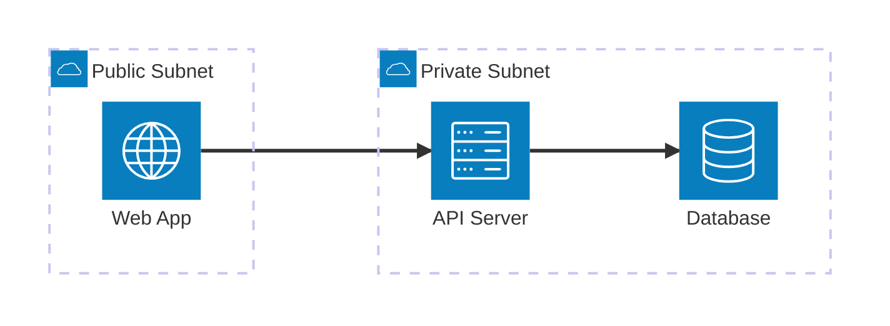

# Mermaid Architecture Diagram Tests

## Basic Architecture Diagram (Default Icons)


## AWS Architecture with Iconify Logos

```mermaid
architecture-beta
    group aws_cloud(cloud)[AWS Cloud]
    group public_subnet(cloud)[Public Subnet] in aws_cloud
    group private_subnet(cloud)[Private Subnet] in aws_cloud
    
    service webapp(logos:aws)[Web Application] in public_subnet
    service api(logos:aws-api-gateway)[API Gateway] in public_subnet
    service lambda(logos:aws-lambda)[Lambda Function] in private_subnet
    service rds(logos:aws-rds)[RDS Database] in private_subnet
    
    webapp:R --> L:api
    api:B --> T:lambda
    lambda:R --> L:rds
```


## AWS Architecture with Dynamic Real Icons

```mermaid
architecture-beta
    group vpc(cloud)[VPC]
    group public_subnet(cloud)[Public Subnet] in vpc
    group private_subnet(cloud)[Private Subnet] in vpc
    
    service tgw(awssvg:transitgateway)[Transit Gateway] in vpc
    service elb(awssvg:elasticloadbalancing)[Load Balancer] in public_subnet
    service ec2(awssvg:ec2)[Web Servers] in public_subnet
    service rds(awssvg:rds)[Database] in private_subnet
    service cloudwatch(awssvg:cloudwatch)[CloudWatch] in vpc
    service route53(awssvg:route53)[Route 53] in vpc
    
    route53:B --> T:elb
    elb:R --> L:ec2
    ec2:B --> T:rds
    tgw:L --> R:ec2
    cloudwatch:B --> T:ec2
    cloudwatch:B --> T:rds
```


## Multi-VPC Transit Gateway with Real Icons
```mermaid
architecture-beta
    group vpc1(cloud)[Production VPC]
    group vpc2(cloud)[Development VPC]
    
    service tgw(awssvg:transitgateway)[Transit Gateway]
    service elb1(awssvg:elasticloadbalancing)[Prod ALB] in vpc1
    service ec2_prod(awssvg:ec2)[Prod Servers] in vpc1
    service ec2_dev(awssvg:ec2)[Dev Servers] in vpc2
    service rds_prod(awssvg:rds)[Prod DB] in vpc1
    service rds_dev(awssvg:rds)[Dev DB] in vpc2
    service monitoring(awssvg:cloudwatch)[CloudWatch]
    
    vpc1:B --> T:tgw
    vpc2:B --> T:tgw
    
    elb1:R --> L:ec2_prod
    ec2_prod:B --> T:rds_prod
    tgw:R --> L:ec2_dev
    ec2_dev:B --> T:rds_dev
    monitoring:B --> T:ec2_prod
    monitoring:B --> T:ec2_dev
```

## AWS Networking with SVG Icons (NEW!)


## Multi-VPC Architecture with Transit Gateway

```mermaid
architecture-beta
    group production_vpc(cloud)[Production VPC]
    group development_vpc(cloud)[Development VPC]
    group shared_services(cloud)[Shared Services VPC]
    
    service prod_app(awssvg:ec2)[Production App] in production_vpc
    service dev_app(awssvg:ec2)[Development App] in development_vpc
    service transit_gw(awssvg:tgw)[Transit Gateway] in shared_services
    service shared_db(awssvg:rds)[Shared Database] in shared_services
    service monitoring(awssvg:cloudwatch)[CloudWatch] in shared_services
    
    prod_app:T --> B:transit_gw
    dev_app:T --> B:transit_gw
    transit_gw:R --> L:shared_db
    transit_gw:B --> T:monitoring
```


## Available Icon Prefixes:
- `logos:` - Iconify logos (basic AWS company logos)  
- `aws:` - Codiva AWS icons (comprehensive service icons)
- `awssvg:` - AWS SVG icons (includes Transit Gateway, VPC, etc.)

## How to Use the Icon Browser
1. Click the grid icon (📋) in the toolbar next to the search button
2. Browse available AWS icons with visual previews
3. Search for specific services (e.g., "ec2", "lambda", "vpc")
4. Click "Copy Usage" to copy the Mermaid syntax
5. Paste into your architecture diagrams

## Common AWS SVG Icon Names:
- `awssvg:transitgateway` - AWS Transit Gateway (dynamically loaded)
- `awssvg:ec2` - Amazon EC2 (dynamically loaded)
- `awssvg:rds` - Amazon RDS (dynamically loaded)  
- `awssvg:elasticloadbalancing` - Elastic Load Balancing (dynamically loaded)
- `awssvg:cloudwatch` - Amazon CloudWatch (dynamically loaded)
- `awssvg:vpc` - Virtual Private Cloud (dynamically loaded)
- `awssvg:route53` - Amazon Route 53 (dynamically loaded)
- `awssvg:s3` - Amazon S3 (dynamically loaded)
- `awssvg:lambda` - AWS Lambda (dynamically loaded)

## Real AWS Architecture Example
```mermaid
architecture-beta
    group aws_cloud(cloud)[AWS Cloud]
    group prod_vpc(awssvg:vpc)[Production VPC] in aws_cloud
    group dev_vpc(awssvg:vpc)[Development VPC] in aws_cloud
    
    service tgw(awssvg:transitgateway)[Transit Gateway] in aws_cloud
    service dns(awssvg:route53)[Route 53] in aws_cloud
    service monitoring(awssvg:cloudwatch)[CloudWatch] in aws_cloud
    
    service prod_alb(awssvg:elasticloadbalancing)[Production ALB] in prod_vpc
    service prod_ec2(awssvg:ec2)[Production Servers] in prod_vpc
    service prod_rds(awssvg:rds)[Production Database] in prod_vpc
    
    service dev_ec2(awssvg:ec2)[Development Servers] in dev_vpc
    service dev_rds(awssvg:rds)[Development Database] in dev_vpc
    
    dns:B --> T:prod_alb
    prod_alb:B --> T:prod_ec2
    prod_ec2:R --> L:prod_rds
    
    prod_vpc:B --> T:tgw
    dev_vpc:B --> T:tgw
    tgw:R --> L:dev_ec2
    dev_ec2:R --> L:dev_rds
    
    monitoring:B --> T:prod_ec2
    monitoring:B --> T:dev_ec2
```