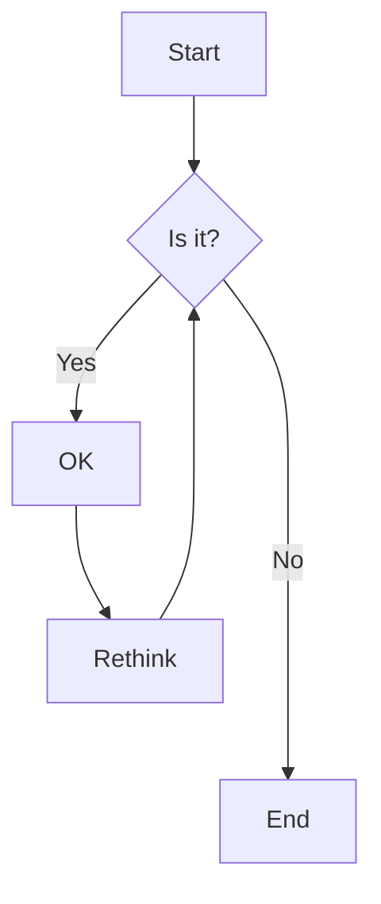

# Diagram Controls Test

This document contains Mermaid diagrams to test the DiagramControls fix.

## Test Diagram 1 - Simple Flowchart

## Test Diagram 2 - Architecture Diagram

## Test Instructions

1. **Hover over each diagram** - controls should appear
2. **Try fullscreen view** - open modal, then close it
3. **After closing modal** - controls should remain responsive
4. **Export as PNG/SVG** - controls should stay visible after export
5. **Switch between diagrams** - all controls should work independently

Expected behavior:

- Controls appear on hover
- Controls remain interactive after fullscreen modal close
- Controls persist after successful exports
- No freezing or unresponsive controls