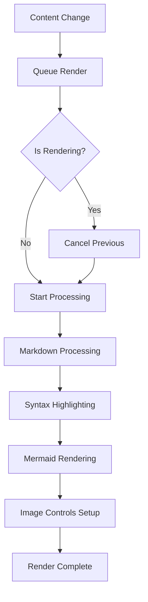

# Test Document for Rendering Orchestrator

This is a test document to verify that the new RenderingOrchestrator is working properly.

## Features to Test

1. **Rapid content changes** - The orchestrator should debounce and cancel obsolete renders
2. **Mermaid diagrams** - Should render properly after markdown processing
3. **Image management** - Should wait for stable render state
4. **Syntax highlighting** - Should coordinate with the orchestrator

## Code Block Test

```javascript
function testRapidChanges() {
  console.log("Testing rapid content changes");
  // This should trigger syntax highlighting
  const orchestrator = new RenderingOrchestrator();
  orchestrator.queueRender(content, theme);
}
```

## Mermaid Diagram Test



## Image Test


This test document will help verify that all rendering components work together properly with the new orchestrator.